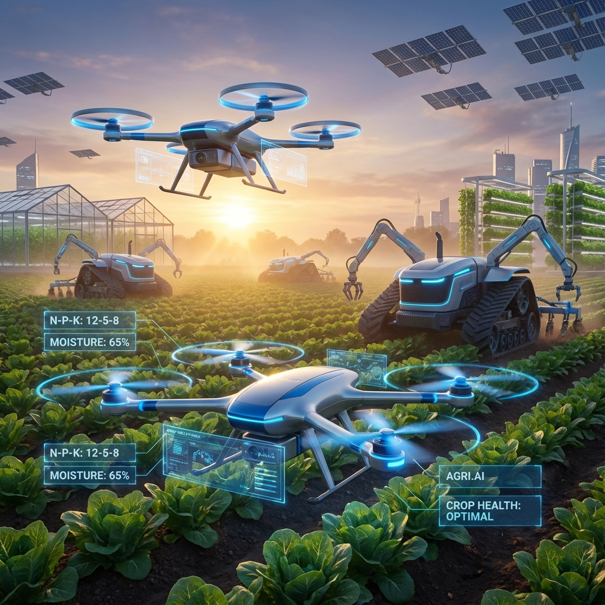

# 🌱 **AGRI.AI - Otonom Çiftlik ve Akıllı Tarım Asistanı**




**AGRI.AI**, modern tarımı yapay zeka ve makine öğrenimi ile birleştiren, çiftçiler için geliştirilmiş kapsamlı bir dijital asistandır. Toprak analizinden ürün önerisine, hastalık tespitinden gübre planlamasına kadar her adımda veriye dayalı kararlar almanızı sağlar.

---

## 🚀 **Özellikler**

### 1. 🌾 Akıllı Ürün Önerisi
Toprağınızın azot (N), fosfor (P), potasyum (K) değerlerini ve bulunduğunuz bölgenin iklim koşullarını analiz ederek en yüksek verimi alabileceğiniz ürünü önerir.

### 2. 🧪 Gübre Tavsiyesi
Topraktaki mevcut besin dengesini ölçer ve ekilecek ürüne göre eksik mineralleri tamamlayacak en uygun gübreleme planını sunar.

### 3. 🦠 Hastalık Tespiti ve Tedavi
Bitki yapraklarının fotoğraflarını yapay zeka ile analiz ederek hastalıkları tanımlar, nedenlerini açıklar (örn. mantar, bakteri) ve tedavi yöntemleri önerir.

---

## 🛠️ **Teknolojiler ve Mimari**

Proje, modern web teknolojileri ve güçlü makine öğrenimi modellerini bir araya getirir.

| Bileşen | Teknoloji | Açıklama |
|---|---|---|
| **Frontend** | React.js, Tailwind CSS | Modern, hızlı ve responsive kullanıcı arayüzü. |
| **Backend** | Flask (Python) | Makine öğrenimi modellerini servis eden API. |
| **ML Modelleri** | Scikit-learn, TensorFlow | Ürün ve gübre tahmini, görüntü işleme ile hastalık tespiti. |

---

## 📂 **Repo Yapısı**

```
otonom_ciftlik/
├── assets/             # Görsel materyaller (Banner, logolar)
├── docs/               # Ek dökümantasyon ve makaleler
│   └── AI_AGRICULTURE_ARTICLE.md # AI ve Tarım üzerine detaylı makale
├── croprecommender/    # React Frontend uygulaması
├── ML_MODEL/           # Python Backend ve ML Modelleri
│   ├── API/            # Ürün önerisi API'si
│   └── FertAPI/        # Gübre önerisi API'si
├── .gitignore          # Git yapılandırması
├── LICENSE             # MIT Lisansı
└── README.md           # Proje dökümantasyonu
```

---

## 🏁 **Kurulum ve Çalıştırma**

### Ön Gereksinimler
* Node.js ve npm
* Python 3.8+

### 1. Frontend (React) Kurulumu

```bash
cd croprecommender
npm install
npm start
```
Uygulama `http://localhost:3000` adresinde çalışacaktır.

### 2. Backend (Flask) Kurulumu

Model API'lerini çalıştırmak için ilgili klasöre gidin:

```bash
cd ML_MODEL/API
pip install -r requirements.txt
python app.py
```

---

## 🤝 **Katkıda Bulunma**

Projeye katkıda bulunmak isterseniz lütfen [CONTRIBUTING.md](CONTRIBUTING.md) dosyasını inceleyin. Her türlü Pull Request ve Issue açılışına açığız!

## 📜 **Lisans**

Bu proje [MIT](LICENSE) lisansı ile lisanslanmıştır.

---

## 📞 **İletişim**

Sorularınız veya önerileriniz için:
* **Geliştirici:** Bahattin Yunus
* **LinkedIn:** [Profiliniz](https://www.linkedin.com)
* **Email:** [email@example.com](mailto:email@example.com)

---
<p align="center">
  <i>Geleceğin tarımı, bugünün teknolojisiyle. 🌱</i>
</p>
